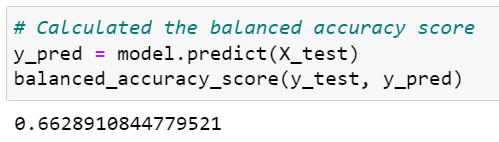
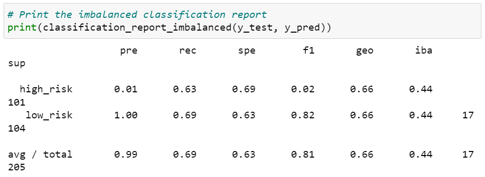
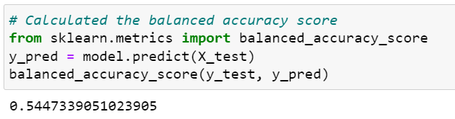
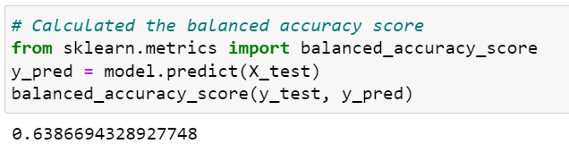
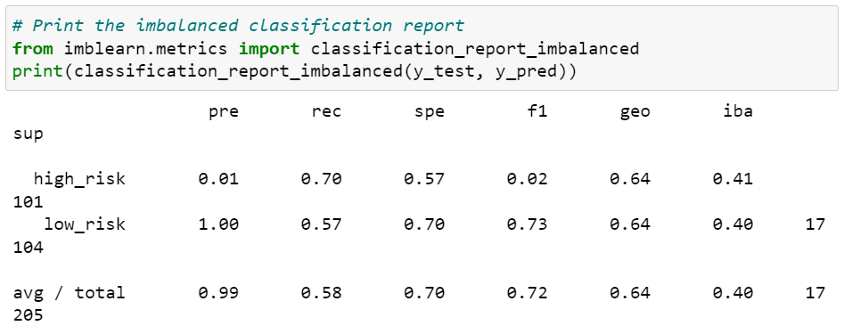
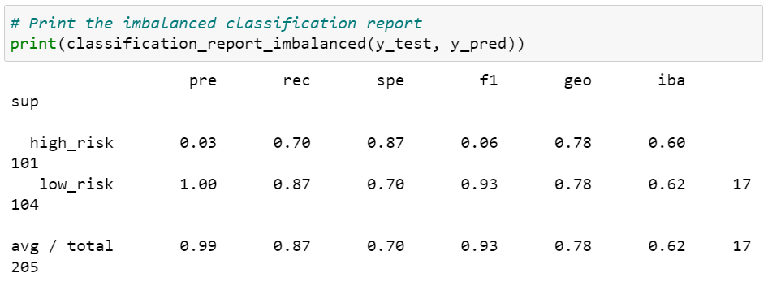
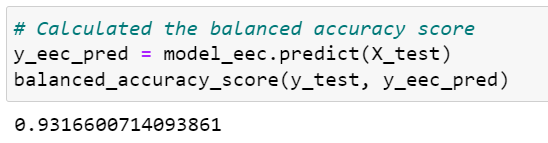
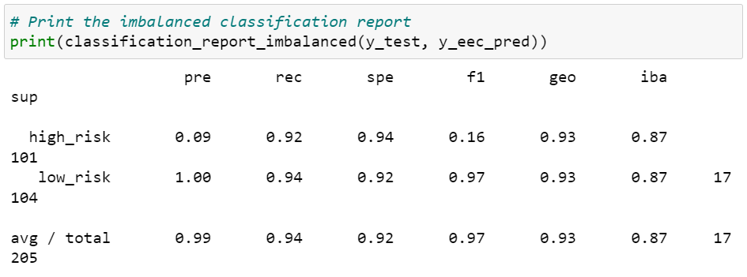

# Credit Risk Analysis

## Overview of the Loan Prediction Risk Analysis:
Explain the purpose of this analysis.
The purpose of this analysis is to use machine learning models to predict credit risk. This will lead to a better loan processing experience with a more efficient method of choosing loan candidates and less possibility of loan defaults.

## Results:
Using bulleted lists, describe the balanced accuracy scores and the precision and recall scores of all six machine learning models. Use screenshots of your outputs to support your results.

Six machine learning algorithms were used to evaluate the credit risk data: Naive Random Oversampling, SMOTE Oversampling, Cluster Centroids, SMOTEENN, Balanced Random Forest Classifier, and Easy Ensemble Classifier.

- **Naive Random Oversampling**
    - Balanced Accuracy Score: 64%
    - Precision Score: High Risk (1%), Low Risk (100%)
    - Recall Scores: High Risk (69%), Low Risk (59%)
    
    

- **SMOTE Oversampling**
    - Balanced Accuracy Score: 66%
    - Precision Score: High Risk (1%), Low Risk (100%)
    - Recall Scores: High Risk (63%), Low Risk (69%)
    
    

- **Cluster Centroids**
    - Balanced Accuracy Score: 54%
    - Precision Score: High Risk (1%), Low Risk (100%)
    - Recall Scores: High Risk (69%), Low Risk (40%)
    
    

- **SMOTEENN**
    - Balanced Accuracy Score: 64%
    - Precision Score: High Risk (1%), Low Risk (100%)
    - Recall Scores: High Risk (70%), Low Risk (57%)
    
    

- **Balanced Random Forest Classifier**
    - Balanced Accuracy Score: 79%
    - Precision Score: High Risk (3%), Low Risk (100%)
    - Recall Scores: High Risk (70%), Low Risk (87%)
    
    

- **Easy Ensemble Classifier**
    - Balanced Accuracy Score: 93%
    - Precision Score: High Risk (9%), Low Risk (100%)
    - Recall Scores: High Risk (92%), Low Risk (94%)
    
    

## Summary:
This project throroughly conducted an analysis of six machine learning techniques and analyzed the balance accuracy score and the precision and recall scores. The model that is highly recommended, with the highest accuracy score of 93% is the Easy Ensemble Classifier.